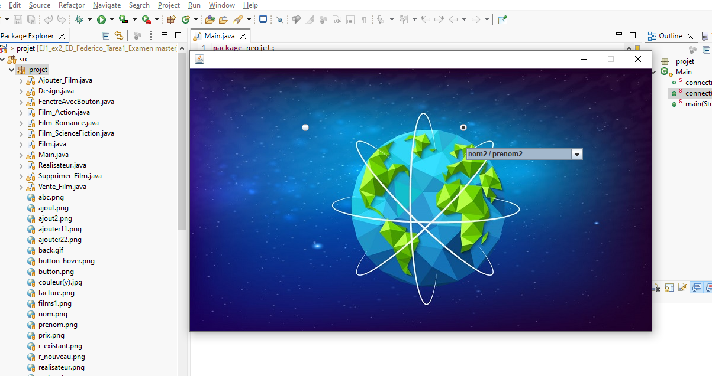

# Proyecto Cine - Examen Federicos

Este programa se basa o prentende ser un reproductor de películas

## Descripción

Es una aplicación de ventanas donde puedes ver, añadir y borrar películas y directores. También puedes ver cómo van las ventas con un gráfico.

## ¿Qué hace el programa?

### 1. El Menú (`Design.java`)
Es la pantalla que sale al principio. Tiene botones con imágenes que cambian cuando pasas el ratón por encima (efecto visual). Desde aquí vas a las otras partes.
*   **Intersante:** Hay un botón de estadísticas que te abre una ventana con un gráfico de barras usando una librería externa. Te enseña cuánto se ha vendido.

### 2. Gestionar Películas y Directores
*   **Añadir Películas (`Ajouter_Film.java`):**
    Aquí metes el título, precio y de qué género es la película.
    *   Puedes elegir un director que ya exista de una lista o crear uno nuevo ahí mismo activando una opción.
*   **Borrar cosas (`Supprimer_Film.java`):**
    Sirve para quitar películas o directores que ya no quieras. La pantalla cambia según lo que elijas borrar.

### 3. Ventas
*   Hay una parte para gestionar las ventas (`Vente_Film`).

## ¿Qué he usado para hacerlo?

- **Java:** El lenguaje de programación.
- **Ventanas (Swing):** Para hacer todos los botones, cuadros de texto y las pantallas.
- **Base de Datos:** JDBC para guardar las cosas y que no se pierdan al cerrar.
- **JFreeChart:** Una librería que bajé para que el gráfico de barras se vea bien.

## Archivos importantes

- **`Design`**: La pantalla principal.
- **`Ajouter_Film`**: La pantalla de añadir.
- **`Supprimer_Film`**: La pantalla de borrar.
- **`Film` y `Realisateur`**: Son las clases que se encargan de hablar con la base de datos (hacer los INSERT, DELETE y SELECT).
- **`Main`**: Donde se conecta con la base de datos.

## Notas para que funcione

1. Necesitas las librerías `jfreechart` y `jcommon` para que no de error.
